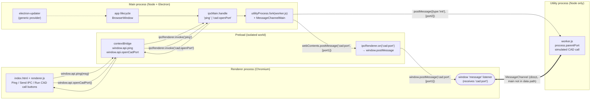

# electron-demo

A minimal Electron + `electron-vite` POC that demonstrates the three Electron process types working together:

- a **main** process that owns the app lifecycle and brokers IPC,
- a **renderer** process (Chromium) for the UI, bridged by a **preload** script, and
- an out-of-process **utility** process (Node-only) used to simulate a heavy, potentially-blocking native call (e.g. a SolidWorks / CAD COM round-trip) without stalling either the UI or the main process.

It also wires up `electron-updater` against a `generic` provider so unsigned local builds can still auto-update for POC/demo purposes.

## Architecture



### How a request flows

**Classic request/response IPC (`Ping` / `Send IPC` buttons)**

1. Renderer calls `window.api.ping(msg)` exposed by the preload.
2. Preload forwards it as `ipcRenderer.invoke('ping', msg)`.
3. Main handles it via `ipcMain.handle('ping', …)` and returns a plain object, which resolves the renderer's promise.

**Out-of-process CAD call (`Run CAD call` button)**

This is the interesting part. The goal is to keep the main process out of the data path so a slow/blocking native call in the worker cannot freeze the UI or the app lifecycle.

1. Renderer calls `window.api.openCadPort()`. Before awaiting it, it registers a `window.addEventListener('message', …)` listener so it won't miss the port.
2. Main handles `cad:openPort`:
   - `utilityProcess.fork('worker.js')` spawns a Node-only child process.
   - `new MessageChannelMain()` creates a `{ port1, port2 }` pair.
   - `port2` is sent to the worker via `child.postMessage({ type: 'init' }, [port2])`.
   - `port1` is sent to the renderer via `event.sender.postMessage('cad:port', null, [port1])`. (An `ipcMain.handle` return value cannot carry `MessagePort`s, so we use a separate fire-and-forget IPC and just resolve the invoke with `true`.)
3. The preload receives `cad:port` on `ipcRenderer` and re-transfers the port to the page with `window.postMessage('cad:port', '*', ipcEvent.ports)`. A live `MessagePort` cannot be proxied through `contextBridge` — its `onmessage`/`postMessage`/`start` don't survive the isolated-world boundary — so `window.postMessage` (which natively handles transferables) is used instead.
4. Renderer's window `message` listener picks up the port, calls `port.start()` (transferred ports arrive paused), and `port.postMessage({ type: 'cadCall' })`.
5. Worker receives the call on its port, simulates work (`setTimeout` + a 16 MiB `ArrayBuffer`), and posts the result back. Bytes flow **worker → renderer** directly over the `MessageChannel`; main is no longer involved.

> Gotcha worth remembering: `MessagePortMain.postMessage`'s transfer list only accepts `MessagePortMain` instances — unlike DOM `MessagePort` in the renderer, `ArrayBuffer`s can't be zero-copy transferred from the utility process. Structured clone still ships the bytes across the process boundary straight to the renderer's port without hopping through main-process JS.

### Auto-update

`electron-updater` is configured as a `generic` provider pointing at `http://127.0.0.1:8080/` (see `electron-builder.yml` and `dev-app-update.yml`). Integrity is verified against the SHA512 in `latest.yml`, so unsigned builds still update correctly for a local POC. On `update-downloaded`, the app calls `autoUpdater.quitAndInstall()`.

To test locally, serve the contents of `dist/` from any static server on port 8080 (for example `npx http-server dist -p 8080`), bump `version` in `package.json`, rebuild, and launch a previously installed version.

## Project layout

```
src/
  main/
    index.js     # app lifecycle, BrowserWindow, IPC handlers, updater, utilityProcess fork
    worker.js    # runs in utilityProcess — owns the renderer-facing MessagePort
  preload/
    index.js     # contextBridge surface + MessagePort relay to the page
  renderer/
    index.html
    src/renderer.js
    assets/…
electron.vite.config.mjs   # declares main + worker as entries, plus preload & renderer
electron-builder.yml       # packaging + generic-provider publish config
dev-app-update.yml         # updater config used in dev
```

## Recommended IDE Setup

- [VSCode](https://code.visualstudio.com/) + [ESLint](https://marketplace.visualstudio.com/items?itemName=dbaeumer.vscode-eslint) + [Prettier](https://marketplace.visualstudio.com/items?itemName=esbenp.prettier-vscode)

## Project Setup

### Install

```bash
$ npm install
```

### Development

```bash
$ npm run dev
```

### Build

```bash
# For windows
$ npm run build:win

# For macOS
$ npm run build:mac

# For Linux
$ npm run build:linux
```
