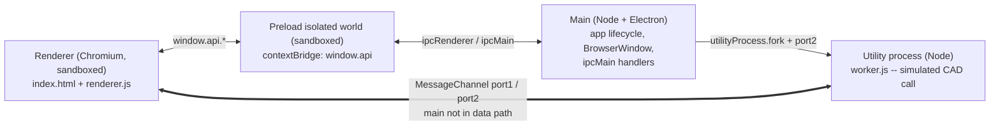
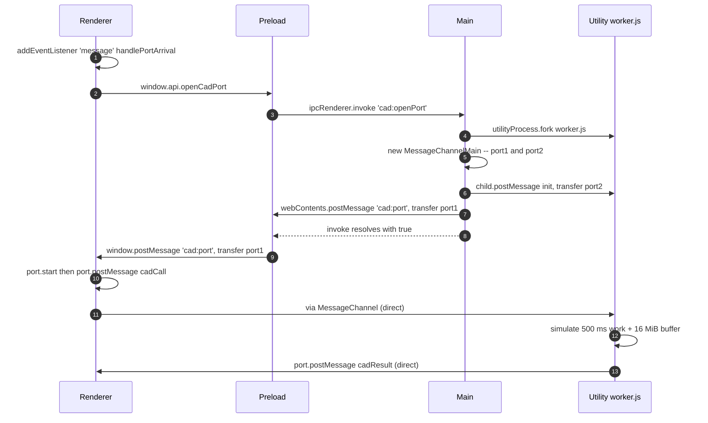
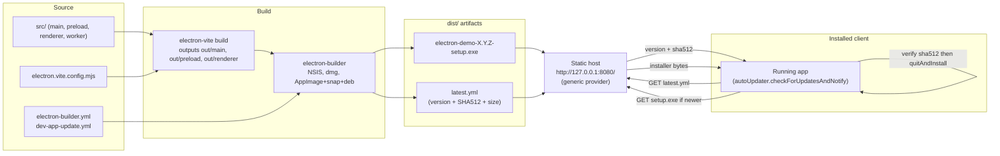

# electron-demo

A minimal Electron + `electron-vite` POC that demonstrates the three Electron process types working together:

- a **main** process that owns the app lifecycle and brokers IPC,
- a **renderer** process (Chromium) for the UI, bridged by a **preload** script, and
- an out-of-process **utility** process (Node-only) used to simulate a heavy, potentially-blocking native call (e.g. a SolidWorks / CAD COM round-trip) without stalling either the UI or the main process.

It also wires up `electron-builder` + `electron-updater` against a `generic` provider so unsigned local builds can still be packaged and auto-updated for POC/demo purposes.

## Architecture & Reliability

### Process model

Four logical units, three OS processes (preload shares the renderer process but runs in an isolated world):



Reliability goal: a slow or blocking native call in the worker must not freeze the UI **or** the main process. The main process forks the worker and brokers the initial `MessagePort` handoff — after that, renderer and worker talk directly over a `MessageChannel`.

Security posture: the renderer and preload both run with Chromium's sandbox on (Electron's default — no `sandbox: false` override) and `contextIsolation` on. The preload only uses the sandbox-safe surface (`contextBridge`, `ipcRenderer`, and `@electron-toolkit/preload`'s allowlist), so any Node-level capability — spawning processes, touching the filesystem, loading a CAD SDK — is confined to the main process and the utility worker where it belongs. If the renderer is ever compromised, the blast radius stops at the IPC boundary.

### Classic request/response IPC (`Ping` / `Send IPC` buttons)

1. Renderer calls `window.api.ping(msg)` exposed by the preload.
2. Preload forwards it as `ipcRenderer.invoke('ping', msg)`.
3. Main handles it via `ipcMain.handle('ping', …)` and returns a plain object, which resolves the renderer's promise.

### CAD port handoff (`Run CAD call` button)

The tricky part: we need to give the renderer a live `MessagePort` connected to the worker, but neither `ipcMain.handle` return values nor `contextBridge` proxies can carry a `MessagePort`. The sequence below shows the workaround.



Why the detours:

- **`MessagePort` can't ride an `invoke` return value** — so main uses a separate fire-and-forget `cad:port` IPC via `webContents.postMessage` and just resolves the original `invoke` with `true`.
- **`contextBridge` can't proxy a live `MessagePort`** — its `onmessage`/`postMessage`/`start` don't survive the isolated-world boundary. The preload re-transfers the port into the page using `window.postMessage`, which natively handles transferables.
- **Transferred ports arrive paused** — the renderer must call `port.start()` before `onmessage` fires.

> Gotcha: `MessagePortMain.postMessage`'s transfer list only accepts `MessagePortMain` instances — unlike DOM `MessagePort` in the renderer, `ArrayBuffer`s can't be zero-copy transferred from the utility process. Structured clone still ships the bytes across the process boundary straight to the renderer's port without hopping through main-process JS.

## Delivery & Enterprise Packaging

### Build → publish → auto-update pipeline



### What's wired up

- **`electron-vite`** declares two main-process entries — `src/main/index.js` and `src/main/worker.js` — alongside `preload` and `renderer`, so the utility worker is bundled as its own output next to `out/main/index.js`.
- **`electron-builder`** packages per-platform installers (NSIS on Windows, dmg on macOS, AppImage/snap/deb on Linux) and emits a `latest.yml` manifest containing the version, filename, SHA512, and size.
- **`electron-updater`** uses the `generic` provider pointed at `http://127.0.0.1:8080/`. Integrity is verified against the SHA512 in `latest.yml`, so unsigned builds still update correctly for a local POC. On `update-downloaded`, the app calls `autoUpdater.quitAndInstall()`.
- **`asarUnpack: resources/**`** keeps native resources outside `app.asar` so anything that needs a real file path (future native add-ons, CAD SDK DLLs, etc.) works after install.

### Testing auto-update locally

1. `npm run build:win` (or `:mac` / `:linux`) — produces the installer + `latest.yml` in `dist/`.
2. Install from that installer.
3. Bump `version` in `package.json`, rebuild so `dist/` contains the new installer and an updated `latest.yml`.
4. Serve `dist/` on port 8080, e.g. `npx http-server dist -p 8080`.
5. Launch the previously installed app — it fetches `latest.yml`, downloads the new installer, verifies SHA512, and relaunches into the new version.

### Code signing (known gap, intentional for POC)

Builds produced by this repo are **unsigned**. On first launch the installer will trip Windows SmartScreen ("Windows protected your PC") and macOS Gatekeeper ("cannot be opened because the developer cannot be verified"). Users can still run it — on Windows via *More info → Run anyway*, on macOS via right-click → Open — but in a real enterprise rollout this is the first thing to fix.

For production you would:

- **Windows** — obtain an OV or EV code-signing certificate (DigiCert, SSL.com, Sectigo, or Azure Trusted Signing) and add `win.certificateFile` / `win.certificatePassword`, or `win.azureSignOptions`, to `electron-builder.yml`. `electron-builder` then invokes `signtool` during packaging and stamps both the installer and the app `.exe`.
- **macOS** — join the Apple Developer Program ($99/yr), add `mac.identity` pointing at a "Developer ID Application" certificate, and enable notarization via `notarize: true` + `APPLE_ID` / `APPLE_APP_SPECIFIC_PASSWORD` / `APPLE_TEAM_ID` env vars. Notarization uploads the signed build to Apple, which staples a ticket Gatekeeper accepts offline.
- **Linux** — generally not signed in the same sense; integrity is handled by distro package signatures (`deb`/`rpm`) or the AppImage `.zsync` + SHA512 already in `latest.yml`.

The existing auto-update flow already verifies SHA512 against `latest.yml`, so it stays safe once signing is added — signing simply adds publisher-identity verification on top of the integrity check.

## Project layout

```
src/
  main/
    index.js     # app lifecycle, BrowserWindow, IPC handlers, updater, utilityProcess fork
    worker.js    # runs in utilityProcess — owns the renderer-facing MessagePort
  preload/
    index.js     # contextBridge surface + MessagePort relay to the page
  renderer/
    index.html
    src/renderer.js
    assets/…
electron.vite.config.mjs   # declares main + worker as entries, plus preload & renderer
electron-builder.yml       # packaging + generic-provider publish config
dev-app-update.yml         # updater config used in dev
```

## Recommended IDE Setup

- [VSCode](https://code.visualstudio.com/) + [ESLint](https://marketplace.visualstudio.com/items?itemName=dbaeumer.vscode-eslint) + [Prettier](https://marketplace.visualstudio.com/items?itemName=esbenp.prettier-vscode)

## Project Setup

### Install

```bash
$ npm install
```

### Development

```bash
$ npm run dev
```

### Build

```bash
# For windows
$ npm run build:win

# For macOS
$ npm run build:mac

# For Linux
$ npm run build:linux
```
